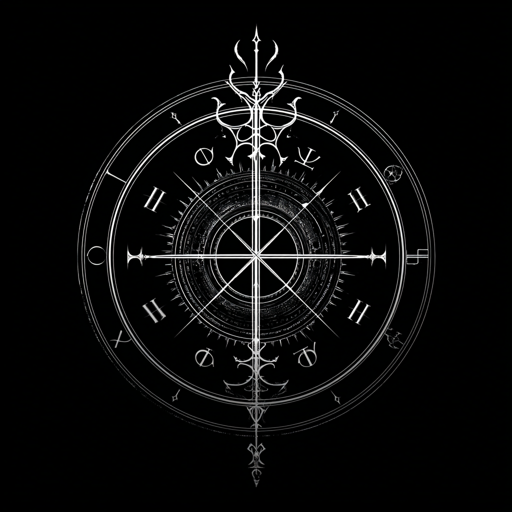

# Malison

<p align="center">
  
</p>

Executable scores for dark electronic music.

## Status

This repository currently contains the Malison language specification and an early Rust implementation of the version `0.1` compiler surface.

Implemented commands:

```bash
cargo run -- check path/to/main.rite
cargo run -- ir path/to/main.rite
cargo run -- events path/to/main.rite
cargo run -- graph path/to/main.rite
cargo run -- scry path/to/main.rite
cargo run -- render path/to/main.rite
```

The version `0.1` renderer defaults to the built-in Rust backend. It supports WAV sample triggers and the `saw_sub` synth needed by the MVP target. An optional SuperCollider backend is also available when `sclang` and `scsynth` are installed.

Try the included MVP working:

```bash
cargo run -- render examples/first-working/main.rite --force
```

This writes:

```text
examples/first-working/renders/first-working.wav
```

To render through SuperCollider:

```bash
cargo run -- render examples/first-working/main.rite --backend supercollider --force
```

`render --backend supercollider --dry-run` emits the generated SuperCollider NRT score script. Add `--keep-backend-files` to retain the generated `.scd` file under the project build directory.

## Development

```bash
cargo test
```

The current JSON IR contract is documented in [docs/IR_SCHEMA.md](docs/IR_SCHEMA.md).

Additional docs:

* [First Rite tutorial](docs/FIRST_RITE.md)
* [Language 0.1 reference](docs/LANGUAGE_0_1.md)
* [Backend capabilities](docs/BACKEND_CAPABILITIES.md)
* [Debugging guide](docs/DEBUGGING.md)
* [Platform notes](docs/PLATFORMS.md)
